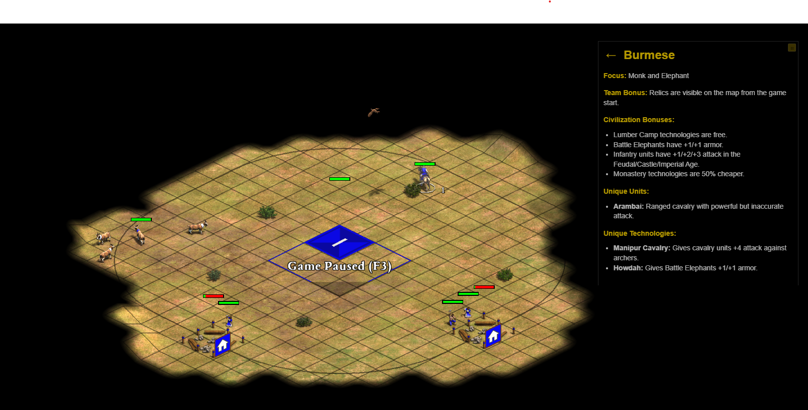

# 🏰 Age of Empires 2 Civilization Overlay



A sleek, always-on-top overlay application that provides instant access to Age of Empires 2 civilization information during gameplay. Perfect for anyone who wants a quick reference without a second monitor or alt-tabbing.

Note: you need to run Age of Empires II in "Full Desktop" in Options → Graphics → Display Mode.


## 📦 How to install?

The quickest way to install it is to download the `.exe` file from the [releases section](https://github.com/mredigonda/AOE2-Civs-Overlay/releases) in this repo.

If you instead prefer to build it from the source code, read below the 🚀 Quick Start guide.

## ✨ Features

### 🎯 Core Functionality

-   **Instant Civilization Lookup**: Search and select any of the 50 civilizations instantly
-   **Comprehensive Civ Information**: View detailed bonuses, unique units, technologies, and more
-   **Always-On-Top**: Stays visible above your game window without interrupting gameplay
-   **Non-Intrusive**: Transparent overlay that doesn't steal focus from your current application

### 🎮 Gaming Optimizations

-   **Click-Through Design**: Only the drag icon and civ selector are interactive - everything else ignores clicks
-   **Focus-Friendly**: Keyboard shortcuts don't interrupt your current application
-   **Windows Optimized**: Uses Windows-specific window types for maximum compatibility
-   **Periodic Enforcement**: Ensures always-on-top behavior persists during long gaming sessions

### 🎨 User Experience

-   **Small Drag Icon**: 16x16px golden icon for easy window repositioning
-   **Smooth Animations**: Hover effects and transitions for better visual feedback
-   **Responsive Design**: Automatically resizes to match content
-   **Golden Theme**: Styled to match Age of Empires 2's aesthetic

### ⌨️ Keyboard Shortcuts

-   **`Ctrl+Alt+\``**: Toggle overlay visibility (doesn't steal focus)

## 🚀 Quick Start

### Prerequisites

**For Windows Development (Building from Source):**

1. **Node.js** (v16 or higher) - [Download here](https://nodejs.org/)
2. **Python 3.8+** - [Download here](https://www.python.org/downloads/)
3. **Git** - [Download here](https://git-scm.com/download/win)

**For Running Pre-built Executable:**

-   Windows 10/11 (no additional software required)

### 🪟 Windows Development Setup

**Option A: Automated Setup (Recommended)**

1. **Download and install prerequisites:**

    - [Node.js](https://nodejs.org/) (v16 or higher)
    - [Python 3.8+](https://www.python.org/downloads/)
    - [Git](https://git-scm.com/download/win)

2. **Run the automated setup script:**

    ```cmd
    # Clone the repository
    git clone <repository-url>
    cd aoe2-civs-overlay

    # Run the setup script
    setup-windows.bat
    ```

The script will automatically:

-   Verify all prerequisites are installed
-   Install Node.js dependencies
-   Create and configure Python virtual environment
-   Install Python dependencies
-   Test the build process
-   Provide clear error messages if anything fails

**Quick Verification:**
If you want to check your setup without running the full setup:

```cmd
verify-windows-setup.bat
```

**Option B: Manual Setup**

**Step 1: Verify Prerequisites**

Open Command Prompt or PowerShell and run these commands to verify your installations:

```cmd
# Check Node.js version (should be 16.0.0 or higher)
node --version

# Check npm version
npm --version

# Check Python version (should be 3.8.0 or higher)
python --version

# Check Git version
git --version
```

**Step 2: Clone and Setup**

```cmd
# Clone the repository
git clone <repository-url>
cd aoe2-civs-overlay

# Install Node.js dependencies
npm install
```

**Step 3: Setup Python Environment**

```cmd
# Navigate to Python experiment directory
cd python-experiment-rapidocr

# Create virtual environment
python -m venv .venv

# Activate virtual environment (Windows)
.venv\Scripts\activate

# Install Python dependencies
pip install -r requirements.txt

# Install PyInstaller for building executables
pip install pyinstaller

# Return to project root
cd ..
```

**Step 4: Verify Python Setup**

```cmd
# Activate the environment again (if needed)
cd python-experiment-rapidocr
.venv\Scripts\activate

# Test Python imports
python -c "import rapidocr_onnxruntime; import PIL; print('✅ Python dependencies installed successfully')"

# Deactivate environment
deactivate
cd ..
```

**Step 5: Build the Application**

```cmd
# Build Python OCR service
npm run build-python-win

# Build Windows executable
npm run dist-windows
```

**Step 6: Find Your Executable**

-   Navigate to the `dist` folder
-   Look for `AOE2 Civs Overlay.exe`
-   Double-click to run

### 🔧 Troubleshooting

**"The system cannot find the path specified" Error:**

-   Make sure you're running commands from the project root directory
-   Verify Python virtual environment exists: `dir python-experiment-rapidocr\.venv`
-   Re-run the Python setup steps if the `.venv` folder is missing

**Python Import Errors:**

-   Ensure you're using Python 3.8 or higher
-   Try reinstalling dependencies: `pip install --upgrade -r requirements.txt`
-   Check if you're in the correct virtual environment (should see `(.venv)` in your prompt)

**Node.js Errors:**

-   Ensure Node.js version 16+ is installed
-   Try clearing npm cache: `npm cache clean --force`
-   Reinstall dependencies: `rm -rf node_modules && npm install`

### Local Development

1. **Start the application**

    ```cmd
    npm start
    ```

2. **Test Windows-specific features**

    ```cmd
    npm run start-test
    ```

### Build Options

-   **Portable Build**: `npm run dist-windows` (recommended)
-   **Debug Build**: `npm run dist-windows-debug` (for troubleshooting)

## 🎯 How to Use

1. **Launch the overlay** - The window will appear in the top-right corner
2. **Position it** - Click and drag the golden icon (⋮⋮) to move it anywhere on screen
3. **Search civilizations** - Type in the search box to find any civilization
4. **View details** - Click on a civilization to see comprehensive information
5. **Toggle visibility** - Use `Ctrl+Alt+\`` to show/hide the overlay during gameplay

## 🏛️ Civilization Information

Each civilization displays:

-   **Focus**: Primary gameplay focus
-   **Team Bonus**: Bonus shared with allies
-   **Civilization Bonuses**: Unique advantages
-   **Unique Units**: Special military units
-   **Unique Technologies**: Special upgrades
-   **Unique Buildings**: Special structures (where applicable)

## 🔧 Technical Details

### Architecture

-   **Frontend**: Vanilla JavaScript with modern CSS
-   **Backend**: Electron for cross-platform desktop functionality
-   **OCR Engine**: Python-based RapidOCR for text recognition
-   **Data**: JSON-based civilization database
-   **Styling**: Custom CSS with Age of Empires 2 theming

### Windows Optimizations

-   **Window Type**: Uses `toolbar` window type for better always-on-top behavior
-   **Always-On-Top Level**: `screen-saver` level for maximum compatibility
-   **Focus Management**: `showInactive()` prevents focus stealing
-   **Periodic Enforcement**: 5-second intervals ensure persistent behavior

### Performance

-   **Lightweight**: Minimal resource usage
-   **Fast Search**: Instant civilization lookup
-   **Smooth Dragging**: Native window dragging via CSS
-   **Memory Efficient**: No unnecessary background processes

## 📞 Support

If you encounter any issues or have suggestions:

-   Open an issue on GitHub

---

**Happy gaming! 🎮⚔️**

_May your civilizations prosper and your strategies prevail!_

(yes, the above, and in fact, the whole project, was super vibe-coded)
